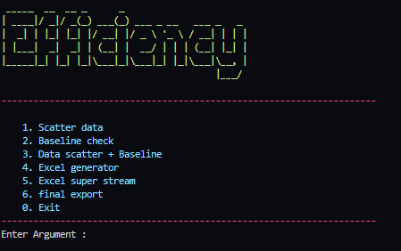

# Resource Efficiency

This project is developed to optimize mobile phone network parameters through machine learning. An example of the dataset used in the model is included as an example. CurveFit method in scipy library is used in this algorithm.

