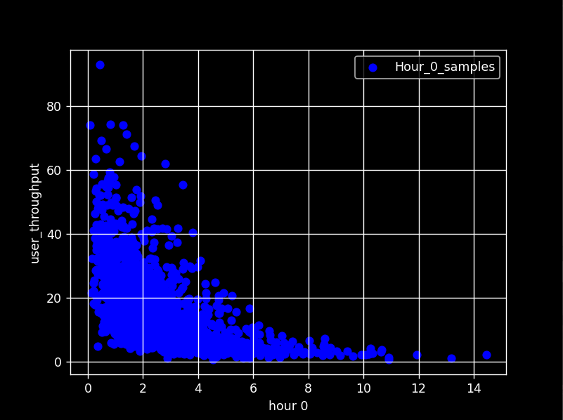
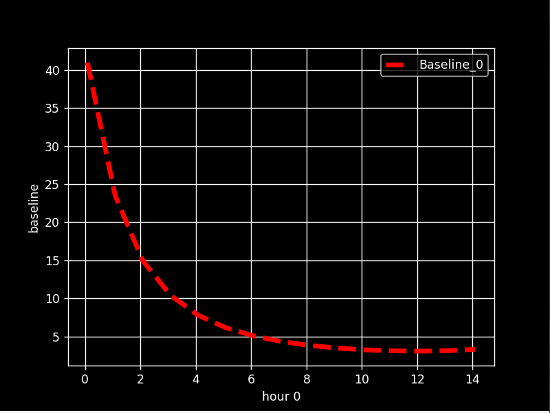
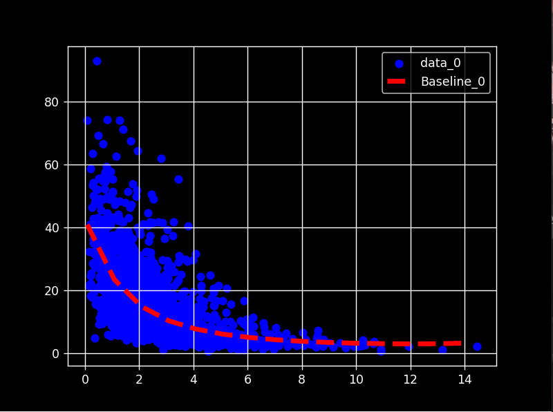

# Resource Efficiency

This project is developed to optimize mobile phone network parameters through machine learning. An example of the dataset used in the model is included as an example. CurveFit method in scipy library is used in this algorithm.
the target data is downlink_user_throughput and the feature is number of users / bandwidth(MHz)
We calculate the baseline for every busy hour time of day (0-23) and generate final calculated baseline data
for each hour.

## Manual 

(it would be recommanded to pass steps one by one)

## 1. scatter raw data for recheck (some samples may need to be delete as noise) # you have to close plot to see next one

## 2. baseline check give you the baseline for each our (hours with insufficient samples may be skipped)

## 3. create the curve_fit model (raw data + base line for each hour)

## 4. create excel files of calculated coefficients and baseline values for each provicne
## 5. merge all files
## 6. final data

# Requirements

- scipy
- pandas
- numpy
- sklearn
- matplotlib
- xlswriter
- Pyfiglet
